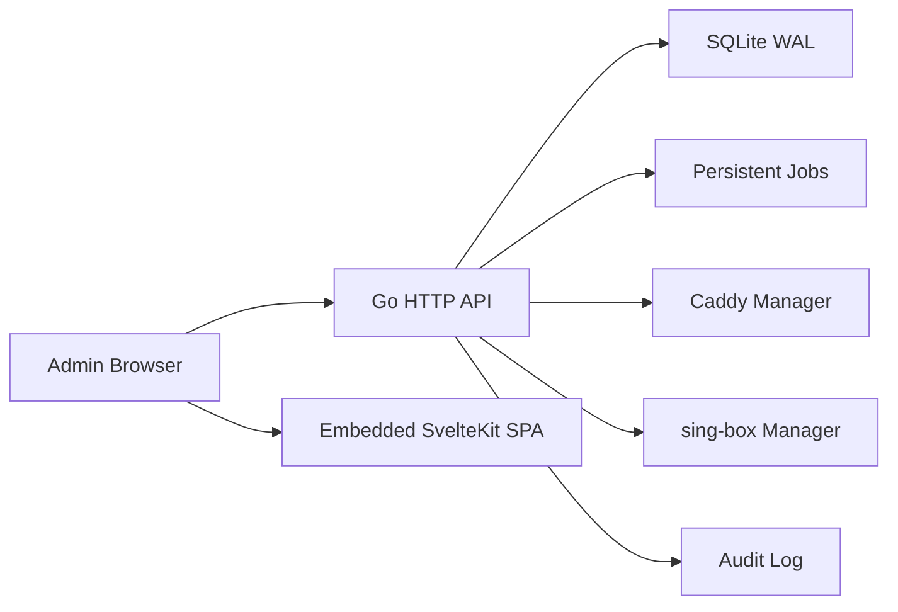

# OMO Architecture

## Topology

OMO ships as a single Go binary named `omo`. The binary exposes REST APIs, serves embedded SvelteKit static assets, manages SQLite state, and coordinates system services such as Caddy and sing-box through backend modules.

## Backend Modules

- `cmd/omo`: Main server binary.
- `cmd/omoctl`: Administrative CLI placeholder for later phases.
- `internal/api`: HTTP routing, response envelope, SPA serving.
- `internal/store`: Database open/migration support.
- `internal/bootstrap`: Initialization state machine.
- `internal/auth`: Token helpers and Argon2id password hashing.
- `internal/jobs`: Persistent job model.
- `internal/configgen`: Configuration rendering and validation boundary.
- `internal/core/singbox`: sing-box integration.
- `internal/protocol`: Service profile registry and scoring model.
- `internal/subscription`: Configuration distribution.
- `internal/diagnostics`: Server checkup providers.
- `internal/audit`: Audit logging.

## Data Flow

1. The browser calls `/api/*`.
2. Safe API responses prepare a readable `omo_csrf` cookie; browser state-changing API requests must echo it in `X-CSRF-Token`.
3. Handlers return a unified response envelope with `success`, `data`, `error`, and `requestId`.
4. Long-running operations create durable job records and stream progress through SSE.
5. Configuration changes are rendered by backend templates, validated, atomically applied, health checked, and either committed or rolled back.
6. Frontend assets are built in `web/` and embedded into the Go binary from `web/build`.

## Bootstrap Flow

1. On startup, OMO opens SQLite, applies embedded migrations, and generates a one-time initialization token if no administrator exists.
2. The installer writes a temporary `omo-init.service` on a random HTTP port and prints a direct one-time link such as `http://SERVER_IP:RANDOM_PORT/init?token=...`.
3. `/init` submits administrator credentials and domain intent through `POST /api/bootstrap/start`.
4. The backend validates the token, enforces password strength, creates the administrator with Argon2id hashing, creates an HttpOnly session cookie, records job state, and invalidates the one-time token after the HTTPS entry is configured.
5. `/api/bootstrap/events` streams persisted bootstrap events through SSE so the page can recover progress after refresh.
6. Administrators can sign in through `/api/auth/login`, inspect their session through `/api/auth/me`, and revoke the session through `/api/auth/logout`; failed login counts and temporary lockouts are persisted in SQLite so restart does not clear an active lockout.
7. On success the backend writes the bootstrap ready marker. `omo-init-watch.service` starts the regular loopback-only `omo.service`, confirms the local health endpoint, then disables and stops the temporary initialization services.
8. The frontend redirects to `https://{configured-domain}/dashboard`.

## Phase 2 Entry Management

`internal/caddy` owns domain and HTTPS entry management:

- Domain DNS checks use a resolver abstraction and can compare resolved records with expected server IPs.
- Port checks verify local TCP availability for 80/443 before attempting entry configuration.
- Caddy config rendering is backend-only and writes a temporary file before validation.
- The installer prepares `/etc/caddy/Caddyfile` to import OMO-managed snippets from `/etc/caddy/omo/*.caddy`, leaving Caddy running with no default public site until bootstrap applies a verified domain entry.
- The installer checks system time synchronization and prints firewall/security-group guidance for the temporary initialization port plus 80/443.
- Config application validates, atomically replaces, reloads Caddy, and restores the previous config if reload fails.
- Certificate status can be read through a TLS connection once Caddy/ACME has provisioned the domain certificate.
- If Caddy is unavailable during bootstrap, the state machine records a degraded `temporary_http` Phase 2 result, returns a retryable `CADDY_UNAVAILABLE` error, and keeps the temporary initialization entry active instead of marking the HTTPS panel ready.
- `scripts/validate-acme.sh` provides a read-only target-server validation gate for the final Phase 2 acceptance check: DNS, local health, systemd service state, public HTTP/HTTPS entry responses, and TLS certificate SAN/issuer/validity metadata.

`internal/bootstrap.CaddyPhase2Hook` connects those checks to the persistent bootstrap job states `DOMAIN_VERIFY`, `TLS_PROVISION`, and `PANEL_HTTPS_ENABLE`.

After initialization settings indicate the panel entry is configured, `internal/api` redirects non-API panel requests to `https://{configured-domain}` unless the request is already HTTPS for that domain. `/init`, `/login`, and `/api/*` stay reachable for bootstrap and API flows.

## Phase 3 Core Management

`internal/core/singbox` owns sing-box core detection before configuration generation begins:

- It resolves a configured binary path, `PATH`, or standard candidate paths such as `/usr/local/bin/sing-box`.
- It executes `sing-box version` with a short timeout and parses the reported version.
- `/api/core/singbox/status` returns installation, executable health, version, path, source, and an operator-readable message.
- `scripts/install.sh` prepares sing-box on new servers and passes the resolved path to `omo serve --sing-box`.

`internal/configgen` now owns the first backend configuration apply/rollback loop:

- It renders service profile selections into an OMO-managed sing-box JSON document.
- It writes a temporary file, validates JSON, backs up the active config, atomically replaces the managed config path, and validates the applied file.
- If post-apply validation fails, it restores the previous validated config.
- `/api/system/overview` returns bootstrap, access-core, version, and service/profile counts for the console overview.
- `/api/services`, `POST /api/services`, and `PATCH /api/services/{id}` expose the persisted managed service instance catalog declared by OpenAPI.
- `/api/services/{id}/apply` and `/api/services/{id}/rollback` create durable jobs and return the unified API envelope.
- Successful apply synchronizes matching planned service instances to `active` with the backend-selected listen port and configuration version. Successful rollback moves active instances for that profile back to `planned`.

This is intentionally file-level and backend-only. Later Phase 3 work can swap the JSON validator for `sing-box check`, then add service reload and health checks without changing the public API contract.

The Svelte service library consumes `/api/services`, `/api/core/singbox/status`, and the apply/rollback APIs to render service cards and persisted service instances. It displays service dependencies, transport/security summaries, client compatibility, core health, and the latest browser-session job result, updates returned service instance state after apply/rollback, but does not assemble or mutate core service configuration locally.

## Phase 4 Smart Subscriptions

`internal/subscription` owns configuration distribution tokens and public subscription output:

- Management APIs create, list, and rotate distribution tokens while persisting only token hashes in SQLite.
- Token plaintext is returned only immediately after create or rotate.
- `/s/{token}` validates active, unexpired tokens, records a request event with a hashed remote address, and returns one of several backend-generated formats.
- Known client hints can receive a specific format automatically; unknown clients receive an adaptive HTML import page with manual format choices.
- Public sing-box and Clash/Mihomo descriptors include metadata for currently active managed service instances so distributed clients can identify the backend-owned service catalog state without the frontend generating core configuration.

The Phase 4 implementation outputs sing-box JSON, Clash/Mihomo-style YAML text, direct URI text, QR code SVG, and the adaptive import page. The Svelte console includes a configuration distribution page for creating and rotating tokens, copying the one-time import URL, and previewing QR import output.

## Phase 5 Server Checkup

`internal/diagnostics` owns the first server checkup workflow:

- `POST /api/diagnostics/run` creates a durable diagnostics job and persists progress events.
- `GET /api/diagnostics/latest` returns the latest saved report plus the latest diagnostics job.
- `GET /api/diagnostics/events` streams diagnostics job events through SSE.
- The provider set is intentionally local and authorized: OMO runtime responsiveness, CPU availability, process memory snapshot, local loopback name resolution, configured panel domain DNS, configured panel domain TLS, local 80/443 reachability, sing-box access-core status, and basic runtime metadata.

Reports are persisted in `diagnostic_reports` as structured JSON while summary/status columns remain queryable. The `/diagnostics` frontend page can start a checkup, display the latest report, show system snapshot evidence, follow SSE progress, and manage an optional operator-configured HTTPS provider. The optional provider is disabled by default, requires explicit settings saved through `/api/settings`, uses a bounded timeout, and never returns the saved credential value through the API.

## Phase 6 Cascade Nodes

`internal/pairing` owns the first one-hop cascade trust workflow:

- `POST /api/pairing/code` creates a short-lived one-time pairing code for an exit node. The plaintext code is returned once, while SQLite stores only a hash plus public metadata.
- Pairing codes include node ID, domain, temporary public key, expiration, nonce, and an Ed25519 signature over the envelope.
- `POST /api/pairing/accept` verifies the envelope, checks expiration and one-time status, creates a local entry node if needed, creates the remote exit node trust record, creates a pending one-hop cascade pair, marks the code used, writes a durable job, and records an audit log entry.
- If an entry OMO instance does not own the pairing code hash, `POST /api/pairing/accept` performs a bounded HTTPS peer call to `https://{exit-domain}/api/pairing/exchange`. The exit instance verifies and consumes the one-time code, stores the entry node trust record, returns exit metadata bound to the signed code, and both sides persist pending one-hop cascade intent.
- `/api/pairing/exchange` is a narrow machine-to-machine endpoint protected by the signed one-time pairing code rather than browser CSRF. Browser state-changing APIs continue to require CSRF tokens.
- `POST /api/cascade/pairs/{id}/plan` renders a backend-owned one-hop cascade configuration preview and moves pending pairs to `planned`.
- `POST /api/cascade/pairs/{id}/apply` requires an explicit operator confirmation flag before OMO writes the backend-generated cascade configuration, creates a durable job, records audit history, and advances the pair to `applied`.
- `POST /api/cascade/health/sample` samples currently registered cascade nodes with bounded HTTPS health checks, updates latency, online state, response-throughput estimate, and latest error on `cascade_nodes`, and records a durable job.
- `GET /api/cascade/nodes`, `PATCH /api/cascade/nodes/{id}`, and `DELETE /api/cascade/nodes/{id}` expose trust records and allow operator revocation.
- `/cascade` provides the first operator UI for creating pairing codes, accepting pairing codes, reviewing trust records, generating backend-owned configuration plans, confirming apply, sampling link health, disabling nodes, and deleting node relationships.

The current Phase 6 implementation persists trust, supports local or cross-instance pairing, writes one-hop cascade configuration only after operator confirmation, and displays live link health samples.

## Phase 7 Backup And Restore

`internal/backup` owns the first backup/restore workflow:

- `POST /api/backups` creates a durable backup job, snapshots SQLite through `VACUUM INTO`, writes a ZIP archive containing `manifest.json` and `omo.db`, encrypts the archive with AES-256-GCM, records a SHA-256 checksum of the encrypted archive, completes a `backup_records` row, and writes an audit log entry.
- The backup encryption key is generated with secure randomness and stored as a local `0600` key file under the backup directory by default. This key file is intentionally not included in backup archives.
- `manifest.json` records the OMO application version, runtime platform, source database name, per-file metadata for configured managed files, and panel certificate metadata. The default server wiring includes the OMO-managed Caddy config path and sing-box config path when those files exist.
- Certificate backup coverage is metadata-only: OMO records the configured panel domain, certificate availability, issuer when known, source state, and capture time, but does not include private key material or certificate store contents in the archive.
- `GET /api/backups` lists persisted backup records from SQLite.
- `POST /api/backups/{id}/restore` requires `confirm: true`, verifies the archive checksum, decrypts encrypted archives when needed, extracts the database snapshot and configured managed files, verifies per-file checksums, keeps pre-restore copies of overwritten files and the current database, replaces the live database, reopens the store connection, reruns migrations, and records restore job/audit history in the restored database.
- Restore remains backward-compatible with earlier unencrypted ZIP archives.
- Managed file restore is limited to the currently configured backup file allowlist, so an archive manifest cannot redirect restore writes to arbitrary paths.
- `omo serve --backup-dir` configures the archive directory; the default is `data/backups`.

This Phase 7 slice now covers encrypted backup archives, a consistent SQLite data restore path, managed Caddy/sing-box configuration metadata, certificate metadata, managed configuration restoration, release artifact automation, and backend-owned online update apply/rollback with signature verification.

## Phase 7 Audit Listing

`internal/audit` owns the first read-side audit workflow:

- Existing high-risk and administrator operations continue to append durable records to `audit_logs`.
- `GET /api/audit` returns recent audit entries from SQLite, ordered newest first, with a bounded `limit` query parameter.
- Audit details are decoded from JSON into structured response fields. Legacy or malformed detail payloads are preserved under `details.raw` instead of failing the full listing response.

This gives operators visibility into backup, restore, authentication, cascade pairing, cascade configuration, and cascade health sampling history while keeping audit persistence backend-owned.

## Phase 7 Update Check

`internal/update` owns the online update workflow:

- `GET /api/update/check` reads the operator-configured HTTPS update manifest URL from settings and returns a structured update summary.
- `omo serve --update-manifest` can persist the manifest URL at startup. The manifest URL must use HTTPS.
- The check fetches bounded JSON metadata, reports current version, latest version, channel, summary, platform, artifact URL, checksum, and signature metadata.
- Artifact selection is limited to the current `GOOS/GOARCH` platform. The check does not download, replace, restart, or apply binaries.
- `POST /api/update/apply` requires `confirm: true`, creates a pre-update backup, downloads the selected HTTPS artifact, verifies SHA-256 checksum and cosign signature bundle metadata, extracts or copies the new `omo` binary, preserves the current binary as a rollback artifact, replaces the active binary, restarts `omo.service`, runs a local health check, records durable job/audit history, and automatically restores the previous binary if restart or health check fails.
- `POST /api/update/rollback` requires `confirm: true`, restores the last preserved update binary, restarts `omo.service`, runs a health check, and preserves the active binary if rollback health validation fails.
- `omo serve --update-work-dir` configures the durable update workspace; the default is `data/updates`.

The update apply path is deliberately backend-only and requires explicit operator confirmation. The frontend never downloads artifacts or replaces binaries directly.

## Phase 7 Release Automation

The release path is now defined by `.goreleaser.yaml`:

- Release builds create Linux `amd64` and `arm64` binaries for `cmd/omo` and `cmd/omoctl`.
- The frontend static build runs before release builds, so the embedded SPA is included in the main `omo` binary.
- Build-time ldflags inject the release version, commit, and build date through `internal/version`; health responses, backup manifests, update checks, and `omoctl version` use that shared version value.
- Archives follow the installer download convention `omo_{version}_linux_{arch}.tar.gz` and include the main binary, `omoctl`, installer script, systemd unit, and core operations/security docs.
- GoReleaser emits `checksums.txt`, generates SBOM documents for archives and binaries, and signs the checksum file with cosign using a `.sigstore.json` bundle.
- `make release-check` validates the release configuration when GoReleaser is installed, and `make release-snapshot` builds local non-published release artifacts.

## Deployment Paths

Phase 0 supports local startup and health checks. Later phases add:

- `scripts/install.sh` for one-line server installation.
- systemd units in `deploy/systemd`.
- generated Caddy configuration in `deploy/caddy`.
- signed release artifacts, checksums, and SBOM documents.

## Security Baseline

The backend owns all sensitive generation, configuration rendering, persistence, and high-risk operations. The frontend never assembles core service configuration directly.

## Phase 7 Security Scan Automation

`scripts/security-scan.sh` is the local hardening gate and `make security-scan` exposes it to developers and CI:

- Required checks enforce product-boundary wording, damaged-text detection, Go tests, Go vet, frontend tests, and frontend build.
- Optional checks run when installed: GoReleaser config validation, Go vulnerability scanning, Go static security scanning, SBOM inventory generation, and cosign availability checks.
- Missing optional tools are reported as skipped, while required check failures return a non-zero exit code.
